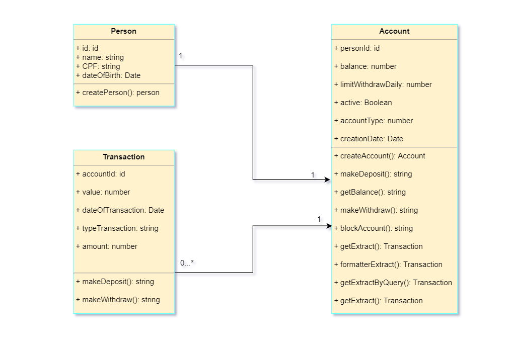

# Dock Bank Code Challenge for Bank Account


**Objective**: Challenge proposed for competence of vacancy application

### Implemented features

* creating account balance
* deposit transaction
* check account balance
* withdraw transaction
* block account
* bank statement
* bank statement by period
* execution manual prepared
* swagger
* Implementation of points of failure and resilience
* design architecture drawing

### Prerequisites
Before you begin, ensure you have met the following requirements:

* [Nodejs + npm](https://nodejs.org/en/)
* [Git installation](https://git-scm.com)
* [MongoDB](https://www.mongodb.com/try/download/enterprise)
* [RoboMongo](https://robomongo.org/download) (optional)  
* [Postman](https://www.postman.com/downloads/) (optional)

### Installation and Running

**Install the dependencies:**

```sh
$ npm install
```

**After installing the dependencies, start the server:**

```sh
$ npm start
```

**(Optional) There is a script (test-dev-back.json) with all the necessary routes for the execution of the requirements. Import it to the postman.**

### Swagger documentation


### Entity Relationship Diagram


